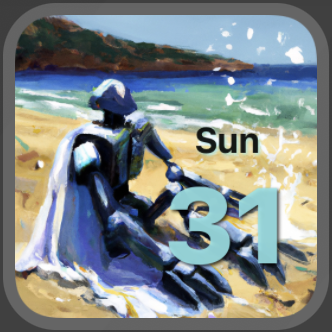

# CalendarWidget
A little decorative calendar widget project.

This is the a small widget project for learning how to create a static widget on iOS.

Lesson is from Sean Allen at seanallen.teachable.com Its a pretty fun class, I recomend checking it out for an intro to widgets in xcode 14, it will work with xcode 13 if you make some pretty simple changes. 

Robot images generated using Dall-E.
